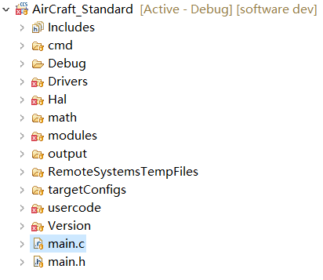

## 尚飞 learning

#### 总体架构图

软件整体分为四层，从上到下依次为：

* **应用层 (Application Layer - usercode/)**: 包含核心业务逻辑、状态机、通讯协议处理、参数管理。
* **算法与模块层 (Algorithm/Modules Layer - modules/)**: 包含电机控制核心算法（PID、Clark/Park变换、SVPWM、观测器等）。这一层大量复用了 TI MotorWare 的设计模式。
* **硬件抽象层 (HAL - Hal/)**: 对底层硬件进行封装，向上提供统一接口，隔离具体硬件细节。
* **驱动层 (Driver Layer - Drivers/)**: 直接操作寄存器，控制 ADC, PWM, GPIO, CAN, SPI 等外设。

#### 目录结构

##### 架构-应用层（usercode/）

主要文件及其功能如下：

* 初始化与主循环:
  * main.c: 程序入口，负责系统初始化。
  * MainInit.c: 负责各功能模块的初始化序列。
  * MainLoop.c: 主循环。

* 状态机 (StateMachine.c):
  * 定义了控制器的生命周期（初始化 -> 待机 -> 预充电 -> 运行 -> 故障）。
  * StateMachine.c: 管理系统从上电初始化、待机(Idle)、预充电(Charge)、运行(Run)到故障(Fault)的所有状态切换。
  * SysFaultCheck.c: 故障检测逻辑（过流、过压、过温等）。

* 控制算法:
  * MotorLocation.c: 电机位置估算。
  * MTPA.c: 最大转矩电流比控制，用于优化电机效率。
  * FreqChange.c: 涉及变频或速度斜坡控制。
  * PIDFloat.c: 浮点 PID 实现。

* 配置管理 (Type_... 目录):
  * ParamReadWrite.c: 参数的读写管理。
  * Type_xxx 文件夹: 这是该架构最灵活的地方，通过包含不同的头文件来适配不同硬件：
    * Type_Motor/: 不同电机的参数（如 Para_Motor_Shanhe31.h）。
    * Type_Drive/: 不同驱动板的参数（如 MOS管/IGBT类型, Para_Drive_120A_MOS.h）。
    * Type_Controller/: 控制器类型定义。
    * Type_Project/: 具体项目宏定义。

##### 架构-算法与模块层 (modules/)

基于 TI InstaSPIN/MotorWare 架构的数学与控制库：

* 数学变换: clarke.c, park.c, ipark.c 构成了 FOC 的基础。
* 波形生成: svgen.c (空间矢量脉宽调制 SVPWM)。
* 估算器 (Observer): est.h 及其相关文件，封装了 TI FAST 观测器或类似的无感算法，用于在没有霍尔传感器的情况下估算转子角度和速度。
* 轨迹规划: traj.c (Trajectory)，用于平滑目标值的变化（如速度斜坡），用于让电机速度平滑地从 A 变到 B，避免突变。

##### 架构-硬件抽象层 (Hal/)

HAL 层将 Drivers 层的功能组合成具体的板级功能对象 hal_obj。应用层通过 halHandle 来操作硬件，而不直接写寄存器。

* hal.c: 定义了 HAL_Handle，HAL 对象的全局初始化和句柄管理。
* hal_pwm.c: 配置 PWM 频率、死区、ADC 触发点。
* hal_adc.c: 配置采样序列、转换结果读取。
* hal_gpio.c: 通用 IO 控制。

作用: 如果将来更换芯片（例如从 28062 换到 280049），只需重写这一层，应用层代码几乎不需要改动。

##### 架构-驱动层 (Drivers/) & cmd/

* Drivers: 这里存放的是针对 TMS320F2806x 芯片的最底层代码，通常直接操作芯片寄存器。包括 adc.c, pwm.c, spi.c, cpu.c 等。

* cmd: 链接器命令文件。
  * F28062F.cmd: 定义了 Flash 和 RAM 的内存映射，决定代码和数据存放在哪里。

#### 关键文件路径索引

| 功能区域 | 关键文件/路径 | 说明 |
|---------|--------------|------|
| 程序入口 | AirCraft_Standard/main.c | 程序入口 |
| 状态流转 | usercode/StateMachine.c | 核心逻辑 |
| FOC 算法 | modules/ 目录 | Clarke, Park, PID, SVGEN |
| 硬件适配 | usercode/Type_Drive/ | 修改硬件参数（如电流采样） |
| 电机适配 | usercode/Type_Motor/ | 修改电机参数 |
| 通讯协议 | usercode/Message/ | CAN/UART 协议解析 |

#### 软件运行流程()

**启动 (main.c):**

1. **硬件底层初始化**: 关闭看门狗，配置系统时钟 (Drivers/clk.c)。
2. **HAL 初始化**: 初始化 HAL 句柄 (Hal/hal.c)，配置 GPIO、PWM、ADC 等外设寄存器。
3. **参数加载**: 从 Flash 或头文件中加载用户参数 (ParamReadWrite.c 读取 Type_... 中的宏，实例化电机和驱动参数)。
4. **算法模块初始化**: 初始化 PID 控制器、FAST 观测器 (Est)、SVPWM 模块等。
5. **使能系统**: 开启全局中断，进入主循环。

**主循环 (usercode/MainLoop.c):**
这是一个无限循环 (Super Loop)，处理低优先级任务，这里使用的为 `while(1)` 循环。*这里建议改为 `for(;;)` ，MISRA-C 标准推荐 `for(;;)` 。*：

   1. **状态机调度 (StateMachine.c)**: 检查故障、处理起停逻辑，决定系统当前处于 Idle、Run 还是 Fault 状态。
   2. **通讯处理 (Message/)**: 解析 CAN/UART 接收到的上位机指令（如转速命令），并打包发送遥测数据。
   3. **慢速保护 (SysFaultCheck.c)**: 监控散热器温度、母线电压（过压/欠压），执行保护逻辑。
   4. **人机交互**: 控制 LED 闪烁频率指示当前状态。

**实时控制中断 (ISR) - (位于 main.c):**
这是 FOC 控制的核心，由 ADC 转换结束 (EOC) 触发，优先级最高：

  1. **数据采集**: 调用 `HAL_readAdcData` 读取三相电流和母线电压。
  2. **坐标变换**: 执行 Clarke 变换 (3相静止 -> 2相静止)。
  3. **状态观测**: 调用 `EST_run` (modules/est)，估算转子磁链角度 (Angle) 和转速 (Speed)。
  4. **坐标变换**: 执行 Park 变换 (2相静止 -> 2相旋转)。
  5. **闭环控制**: 运行速度环和电流环 PID (modules/pid)，计算出目标电压矢量 (Vd, Vq)。
  6. **空间矢量调制**: 执行逆 Park 变换和 SVPWM (modules/svgen)，生成 PWM 占空比。
  7. **硬件输出**: 调用 `HAL_writePwmData` 将占空比写入 PWM 寄存器。

