# 模型的验证和确认

## 目录

1.简介
2.基于模型的设计的验证与确认
3.开发测试用例
4.分析测试结果
5.构建测试套件
6.正式验证模型
7.结论
附录

## 1.简介

## 2.基于模型的设计的验证与确认

## 3.开发测试用例

### 大纲-开发测试用例

### 要求-开发测试用例

#### （1）测试Simulink®模型

*要测试一个Simulink模型，您需要从测试计划中获取信息并将其转换为Simulink可使用的数据。*

    测试用例可以包含：
        输入信号-可以从外部文件中加载，在MATLAB中创建，或使用Simulink源库中的模块创建。输入信号应设计成能够代表现实场景，例如用户输入、运行条件以及环境效应。
        参数-通常应可调，即使用MATLAB变量名进行引用。这使您能够在设计迭代和测试中快速修改它们。
        其他依赖项-为了使测试能够完全重现，您可以选择将额外的模型依赖项视为测试输入的一部分，例如模型配置参数或所使用的Simulink版本。

#### （2）测试框架

*测试框架通常由五个部分组成。*

    Input signals（输入信号） - 定义单个信号的源块，例如SignalBuilder块。
    Conversion blocks（转换块） - 用于将输入信号的原始信号数据转换为测试模型所要求的格式的块。例如，如果模型需要总线信号输入，则可能使用“总线创建器”块。
    Component under test（被测组件）(CUT) - 个隔离的组件或被测试模型的参考。
    Selection blocks（选择块） - 将输出信号数据并选择感兴趣信号的模块。这些通常包括总线选择器或选择器模块。
    Analysis blocks（分析模块） - 接收模块，允许您可视化数据或执行其他分析任务。

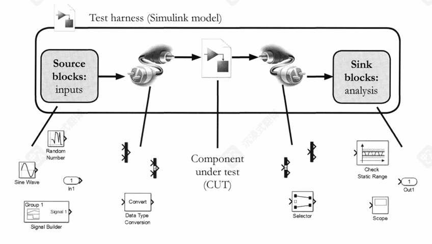

#### （3）生成测试框架

*使用SimulinkTest自动为模型创建测试框架。*

    1.选择 Analysis -> Test Harness -> Create for Model.
    2.在打开的对话框中，在创建测试线束之前指定选项。这些选项包括
        *信息 - 名称和描述
        *结构 - 要添加到信源和信宿
        *配置 - 用于框架创建、重构和组件同步选项
    3.选择确定。
    
    注意：默认情况下，测试框架会保存在被测组件所在的同一文件中。要创建保存在单独文件中的测试框架，您可以启用“将测试框架保存到外部”选项。启用此选项后，将在当前文件夹中创建一个XML文件。该文件包含元数据，用于将测试组件与其外部测试框架关联起来。

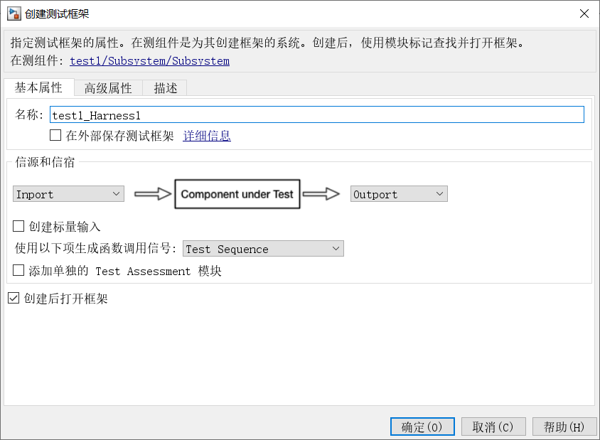

建议：勾选“添加单独的 Test Assessment 模块”

    测试框架中会生成两个独立的 Test Sequence 模块。
        模块1 (信源): 负责根据您的测试用例，在正确的时间产生正确的输入信号或函数调用。
        模块2 (评估): 独立于输入模块，它的唯一职责是捕获被测组件的输出，并使用 verify 语句来判断输出是否符合需求。

## 4.分析测试结果

### 大纲-分析测试结果

    *执行基于需求的评估
    *记录、检查和比较测试结果
    *收集模型覆盖率

### 要求-分析测试结果

    *说明各种信号记录格式和选项。
    *使用Simulink模块对测试结果进行数学分析，以符合要求。
    *交互式可视化、检查和比较测试结果。
    *收集并显示测试用例的模型覆盖率。

### （1）结果分析

*分析仿真测试结果通常涉及检查仿真输出，目标是更好地理解系统行为。*

    结果分析可以手动进行，也可以自动进行。
    
    手动测试结果的可视化，以及数据的交互式分析。
    通常，分析可能是探索性的，没有预先指定的目标。
    
    自动化—使用MATLAB代码或Simulink模块来分析数据，无需人工参与。
    通常分析会有预定义的目标，并且可能存在严格的通过/失败标准。

### （2）分析方法

*关于Simulink模型数据，有两种常见的分析模式。*

**运行时分析：**

        使用simulink模块在仿真期间分析数据。这通常通过使用测试台来完成，这样你就不必在实际系统模型中添加分析模块。
        运行时分析通常在您希望检查模拟的每个时间步长的某些条件，或在其他情况下更自然地用Simulink模块建模时最为有用。

**仿真后分析：**

        收集模拟数据，然后在模拟完成后分析这些数据。这使得你可以将整套结果作为一个整体进行分析，而且可以在任何你方便的时候进行这项分析。

### （3）执行探索性测试

*执行运行时分析的一种方法是通过模拟模型并手动探索模型是否按预期行为。*

        执行探索性分析的一种常见方法是在Simulink->Dashboard库中使用模块。这些模块可用于在Simulink模型中创建人机界面(HMI)。

Dashboard库模块可分为两大主要类别：

        Control（控制） — 用于修改模型中的可调参数和变量。这包括旋钮、滑块、按钮和开关。
        Visualization（可视化） — 用于在模型中可视化信号值。这包括灯、仪表和示波。

### （4）使用模型验证模块的运行时分析

*另一种运行时分析方法是通过在测试harness的输出端添加模块来在仿真过程中对模型输出进行数学分析。这样，分析模块就不再是源模型的一部分，从而实现了设计和验证的分离。*

    包含此功能的一些simulink库：
        Signal Routing（信号路由） - 包含您可用于选择所需信号进行分析的模块。
        Logic and Bit Operations（逻辑和位操作） - 包含作为分析一部分有用的关系和逻辑运算符。
        Sinks（接收器） - 包含您可用于在仿真期间可视化仿真数据的显示模块。
        Model Verification（模型验证） - 包含检查信号范围、变化率或分辨率的模块。这些模块能够在信号违反给定条件时停止仿真并执行MATLAB命令（例如，输出错误消息）。
    
        该库还包含 Assertion block(断言模块)，可以根据逻辑输入信号停止仿真。这允许创建自己的运行时评估逻辑并将其与断言模块结合使用。
        断言的主要目的是在仿真运行期间，当输入信号的逻辑条件（布尔值）为假 (false) 时，立即触发一个错误或警告，并可以停止仿真。

*如果您的测试框架包含信号生成器模块，您可以为单个信号组启用和禁用 Verification block settings（模型验证模块）中的断言。为此，请显示模块的验证设置并使用验证模块设置部分。*

注意：您只能从信号构建器块中 Enable assertion（启用断言），如果该块中禁用了启用断言选项。

### （5）Run-Time Analysis with Test Sequence Blocks（使用测试序列块进行运行时分析）

*上一章中，测试序列模块可以用于生成基于逻辑的测试输入无论是在开环还是闭环配置下。这个块也可以用于分析测试的输出。*

    例如：假设我们希望使用逻辑来停止模拟，如果以下任何条件被违反。
    
    *积分状态的值必须小于1。
    *积分状态的值必须大于-1。
    *在输入信号变为-1之后，积分器状态必须在不超过一个时间步长内去饱和。
    
    由于控制器还有一个比例分支，其增益为Kp，因此测试条件必须考虑到这一偏移由于测试输入使用控制器输入值为1或-1，因此测试条件可以按照以下方式来进行。
    
    控制器输出必须小于(1+Kp)。
    控制器输出必须大于-(1+Kp)。
    控制器输出必须在pedal_scaled信号从1降至-1后的一个时间步(TS)内小于(1-Kp)。
    
    注意 还有一个第四种条件，当pedal_scaled信号从-1步进到1时测试锁定。

方法：

    前两个条件可以使用assert函数进行测试。如果条件为假，模拟将停止并生成错误消息。您可以在函数的第二个参数中自定义错误消息。
    
    assert(controller_output <= (1 + Kp), 'Upper bound exceeded.");
    assert(controller_output >= -(1 + Kp), 'Lower bound exceeded.');

### （6）Conditionally Analyzing Results（条件分析结果）

    第三个测试条件更难检查，因为它
        *需要系统当前状态的信息 — 当控制器输入从1降至0时是什么时候？
        *需要在一定时间后进行检查 - 在这种情况下，控制器输入降至0后的一个时间步。

Simulink 测试序列操作步骤

        1.添加第二个输出：在用于生成测试输入的 Test Sequence（测试序列） 模块中，添加第二个输出，命名为 steppingDown。
        2.设置信号值：当进入 StepDown 步骤时，将 steppingDown 的值设置为 true（真）。当进入 Standby 步骤时，将其值重置为 false（假）。
        3.用作评估输入： 在 Assessment Test Sequence（评估测试序列） 模块中，将 steppingDown 用作一个输入。
        4.启用条件分解： 右键点击（评估模块中的）该步骤，并启用 When decomposition（When 条件分解）选项。这允许该步骤的子步骤根据 when 条件有条件地执行。
        5.创建两个子步骤：创建两个子步骤，如上图所示。第一个子步骤（例如：windup）将在 steppingDown 信号持续为 true 的时间达到或更长时执行。要定义此条件，请使用 duration 函数。第二个子步骤（例如：default）没有 when 条件，它将在没有其他 when 条件为真时执行。此子步骤不执行任何动作。

    注意： windup 子步骤使用了 verify 关键字。这类似于 assert，但当表达式为假时，仿真不会停止。

duration 函数：用于计算一个逻辑条件持续为 true 的仿真时间。

    当 duration 函数后面的输入信号（condition）首次变为 true 时，函数开始计时。只要该条件保持 true，duration 函数将输出自条件首次满足以来所经过的仿真时间。一旦条件变为 false，计时器将重置归零。

示例：Windup when duration(steppingDown) >= Ts

        只有当信号 steppingDown 持续为真的时长达到或超过Ts时，Windup 步骤才会被执行。duration 函数的语法：其中：condition：是一个逻辑表达式（例如 steppingDown、A == B 等）。timeUnit：是一个可选的时间单位，例如 sec（秒）、msec（毫秒）、min（分钟）、hr（小时）等。如果未指定 timeUnit，则默认的时间单位是 sec（秒）。

### （7）Managing Test Sequences（管理测试序列）

为步骤添加描述

    使用“描述列（。）”按钮在测试序列块中显示或隐藏描述列。在此列中，可以输入注释以记录测试的行为。
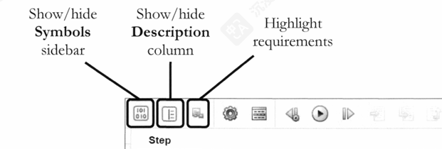

链接和查看要求

    右键单击一个步骤，并使用“需求”下的选项来创建、查看或修改与该步骤相关的要求。

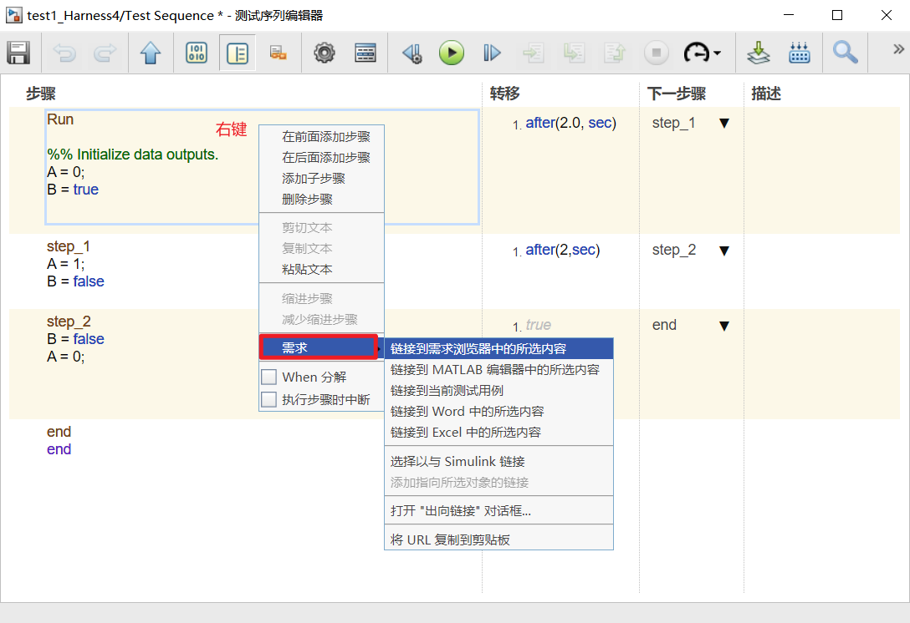

记录的信号—可以指定某些信号进行记录。

        这是记录数据最灵活的方式，并支持所有信号数据类型。
    通过右键单击来记录信号，选择属性，然后启用"记录信号数据"选项来记录信号。
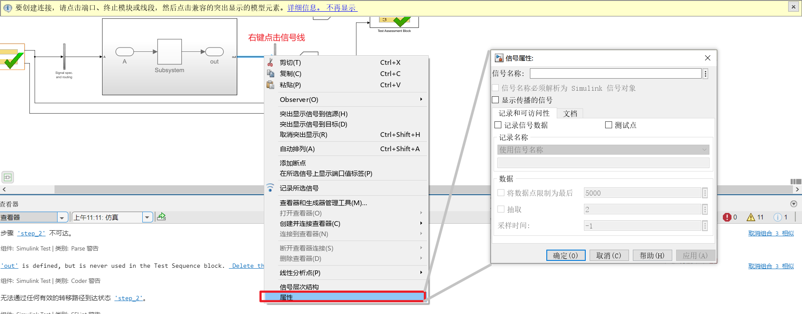

要同时为多个信号启用数据记录，您可以选中多条信号线，然后点击“记录选定信号”选项，记录信号图标显示在信号旁边，以表示信号正在被记录。

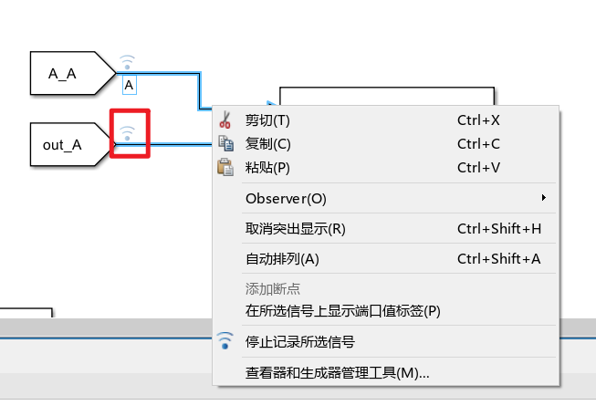

要选择性地将每种类型的元素保存到工作区,可以使用仿真->模型配置参数->数据导入/导出选项,如下所示。

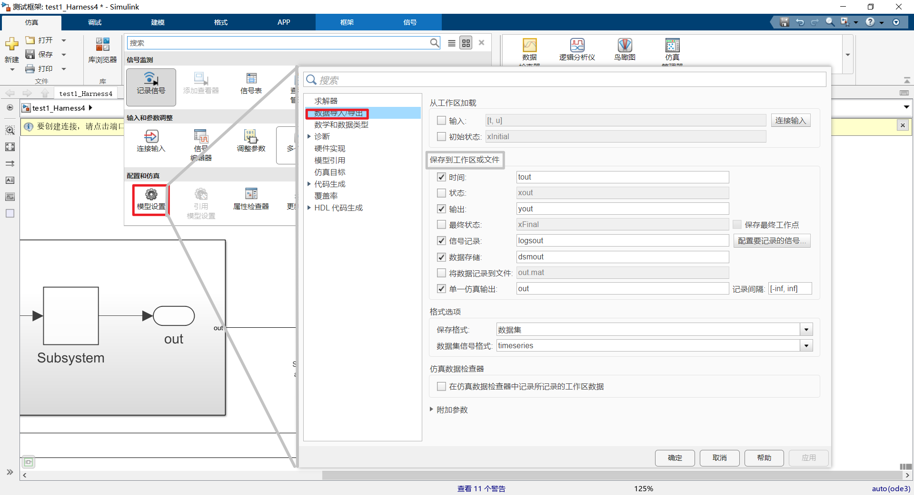

此外，您可以使用 Simulink -> Sinks 库中的以下模块来输出仿真数据:

* To File
* To Workspace
* Scope blocks — 使用配置属性对话框中的日志选项卡将数据记录到工作区。这也适用于信号查看器
  
### （8）Accessing Logged Data（访问已记录数据）

保存到工作区的数据格式可能因保存的内容和选择的格式选项而异。
常见的日志格式包括 

* Array(数组) - 所有数据都存储在一个单一的矩阵中（不支持不同数据类型）
* Structure/Structure with time(结构/带时间的结构) - 每个输出都存储在结构的不同元素中（不支持总线数据类型）
* Dataset(数据集) - 默认的日志格式，用于输出、状态和记录的信号。数据集包含可通过 getElement 函数访问的变量。
  
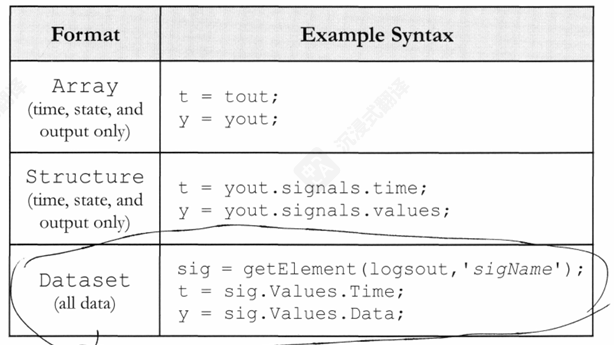

信号记录数据始终采用“数据集”格式。对于输出和状态记录的数据，您可以使用“模拟模型配置参数 - 数据导入/导出”下的“格式”选项来选择输出格式。在上一节管理测试序列中可以找到此步骤。

### （9）Inspecting Logged Data（检查已记录数据）

模拟数据检查器中提供了一个交互式界面，查看和比较模拟数据。需要记录的信号会自动发送至模拟数据检查器。

打开仿真数据检视器：从显示的菜单中选择 Simulation Data Inspector （数据检查器）。

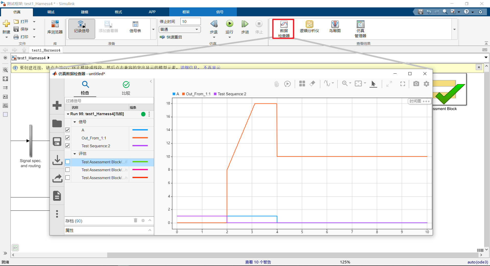

在仿真模型后，您将在仿真数据中看到一个新的运行出现检视器。您可以查看每个信号启用其对应的复选框。

可以使用可视化选项卡中的文件部分中的导入按钮将数据导入仿真数据检查器。然后选择要分析的已记录数据对象。

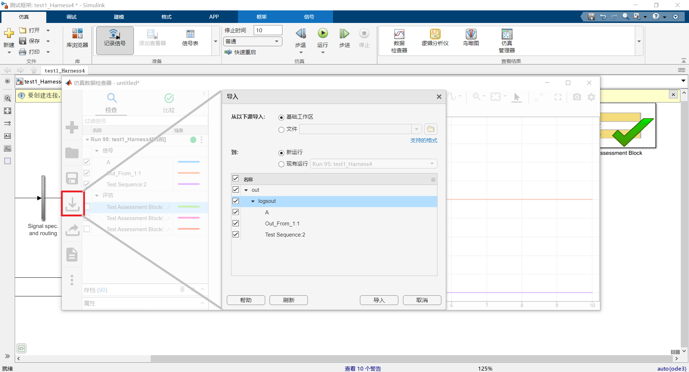

### （10）Customizing Data Displays（自定义数据显示）

默认情况下，信号按数据层次结构分组。
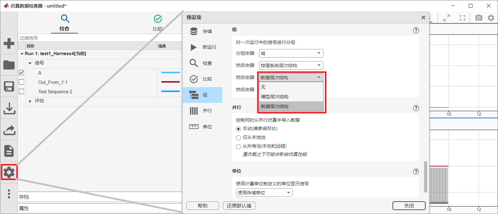

选择数据游标
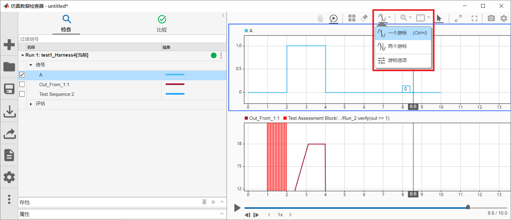

自定义信号外观
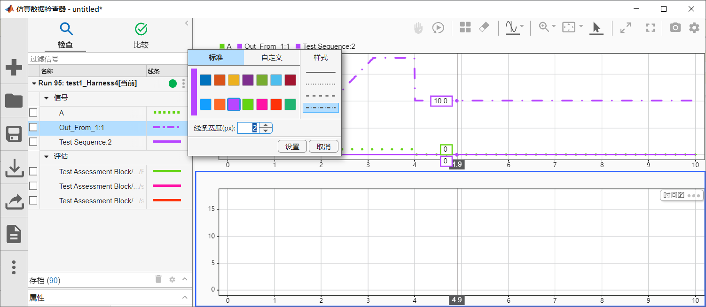

### （11）Comparing Runs and Signals（比较运行和信号）

使用仿真数据检视器来比较单个信号和来自不同运行中的信号。

* 选择导航窗格内的比较选项卡
* 选择您想要比较的运行或信号。
* 点击比较按钮。

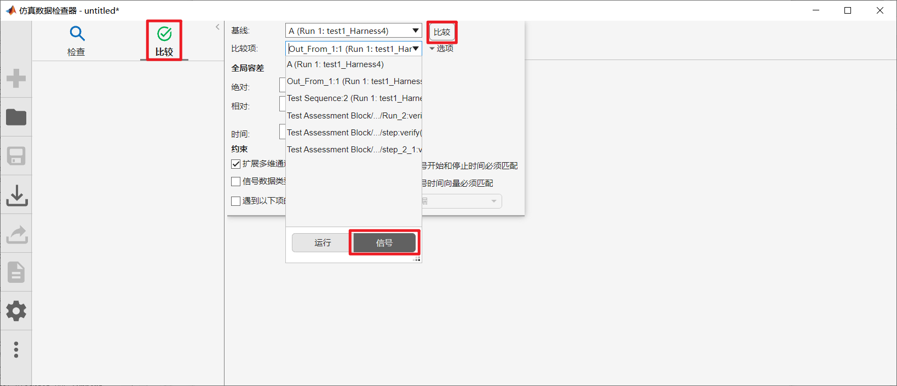

选择一个信号后，将在第一组轴上显示两个运行的信号值，并在第二组轴上显示信号之间的容差和差异。\
可以为每个信号指定AbsTol(绝对容差)RelTol(相对容差)和TimeTol(时间容差)参数。这些参数允许确定两个信号是否在某个指定的容差范围内匹配。
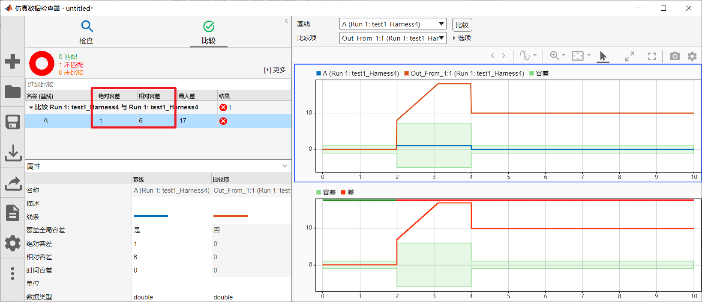

容差可以全局设置也可以针对每个信号单独设置，具体方法是通过右侧显示的选项进行操作。
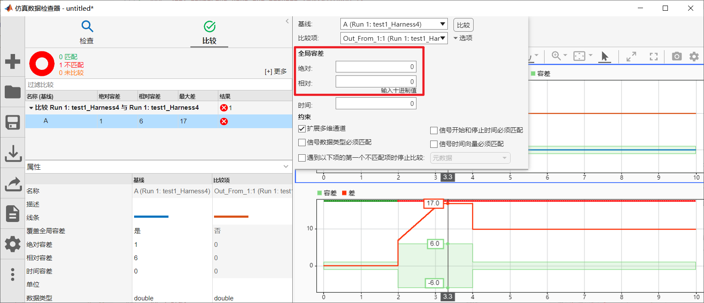

注意，还可以通过点击“创建报告”按钮，自动生成一份基于比较结果的报表。
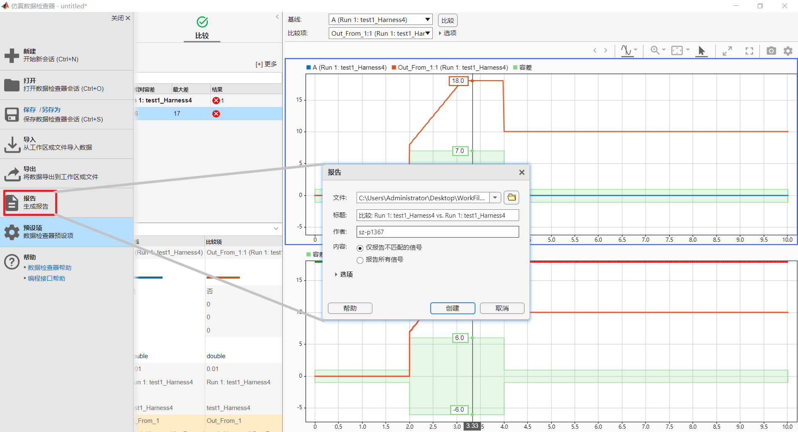
报告如下
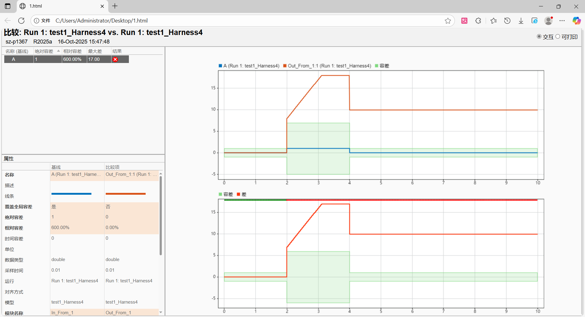

### （12）Collecting Model Coverage（收集模型覆盖率）

### （13）Viewing Model Coverage（查看模型覆盖率）

### （14）Model Coverage Tips（模型覆盖率提示）

## 5.构建测试套件

## 6.正式验证模型

## 7.结论

## 附录

## Test Sequence 用法

### 1.Test Sequence 常用语法

Test Sequence 的语法可以分为三大类：动作 (Actions)、验证 (Verifications) 和 流程控制 (Control Flow)。

#### A. 动作 (Actions) - 控制输入和时间

这些语法用于在测试过程中改变输入值或等待时间。

赋值: 直接给输入端口或局部变量赋值。

    % 将输入端口 In1 赋值为 5
    In1 = 5;

    % 将局部变量 myVar 赋值为 true
    myVar = true;

时间延迟: 等待一段指定的时间。

    % 等待 100 毫秒
    after(100, msec)

    % 等待 2 秒
    after(2, sec)

条件等待: 等待一个条件变为 true。

    % 等待直到 In1 的值大于 10
    when(In1 > 10)
    信号边沿检测: 检测信号的变化，非常适用于事件触发的测试。

    % 检测 In1 的上升沿
    rising(In1)

    % 检测 In1 的下降沿
    falling(In1)

    % 检测 In1 值的任何变化
    changed(In1)
    通常与 when 结合使用: when(rising(In1))

#### B. 验证 (Verifications) - 自动化 PASS/FAIL 判断

verify 语句是用来判断测试是否通过的断言。如果 verify 的条件为 false，测试将立即失败 (FAIL)。这是 DO-178C 自动化测试的核心。

基本验证: 在当前时刻检查一个条件是否为 true。

    % 验证输出端口 Out1 的值是否等于 10
    verify(Out1 == 10);

带时间约束的验证 (Temporal Assessments): 这是 verify 最强大的功能，用于验证有时序要求的行为。

    % 验证: 从当前时刻起，Out1 在 200ms 内必须变为 true
    verify(Out1, within(200, msec));

    % 验证: 当 In1 出现上升沿时，Out1 的值必须大于 5
    verify(when(rising(In1), Out1 > 5));

    % 验证: 在 In1 大于 10 之后的 50ms 内，Out1 必须等于 1
    % 这是一个典型的“响应时间”验证
    verify(when(In1 > 10, Out1 == 1, after(50, msec))); 

#### C. 流程控制 (Control Flow)

    步骤 (Step): 编辑器中的黄色框体就是一个“步骤”。测试逻辑按步骤顺序执行。
    转移 (Transition): 步骤之间通过“转移”连接。    转移条件可以是时间 (after(1, sec)) 或条件 (In1 == 0)。    当转移条件满足时，测试流转到“下一步骤”。

if-else 语句: 用于复杂的条件逻辑。

    if (In1 < 0)
        Out_Cmd = -1;
    else
        Out_Cmd = 1;
    end

### 2. 如何编写测试用例 (基于需求的 AAA 模式)

编写测试用例的最佳实践是遵循 Arrange-Act-Assert (AAA) 模式，这与 DO-178C 基于需求的测试方法完美契合。

示例需求 (Requirement): "当输入信号 Enable 为 true 时，若输入信号 Request 发生上升沿，则输出信号 Grant 必须在 50ms 内变为 true。"

步骤 1: Arrange (准备/初始化)
在第一个 Step (通常可以命名为 Initialize) 中，设置测试的初始状态。

    % Step: Initialize
    % 描述: 设置初始条件，确保系统处于已知状态

    % --- Actions ---
    Enable = true;
    Request = false;
    % Grant 是输出，无需设置
    转移条件: after(10, msec) (等待一小段时间确保初始值生效)

步骤 2: Act (执行/激励)
在第二个 Step (可以命名为 ApplyStimulus) 中，施加触发需求所述行为的激励。

    % Step: ApplyStimulus
    % 描述: 施加 Request 上升沿，触发被测行为

    % --- Actions ---
    Request = true; % 这就产生了一个从 false 到 true 的上升沿
    转移条件: after(100, msec) (执行激励后，等待足够的时间让系统响应)

步骤 3: Assert (断言/验证)
在第三个 Step (可以命名为 VerifyOutcome) 中，使用 verify 语句检查输出是否符合预期。

    % Step: VerifyOutcome
    % 描述: 验证 Grant 信号是否在要求的时间内响应

    % --- Actions ---
    % 这是错误的写法: verify(Grant == true); 因为无法保证时间
    % 这是正确的写法，使用带时间约束的验证:
    % 注: 这种验证通常写在 Act 步骤中，因为它与激励事件紧密相关

    % --- 让我们重构一下 ---
更优的写法：将 Act 和 Assert 结合
对于有时序要求的验证，最好在施加激励的同一个步骤内完成。

    % Step: Test_Request_Response
    % 描述: 施加激励并立即验证其时序响应

    % --- Actions ---
    % Arrange
    Enable = true;
    Request = false;
    after(10, msec); % 等待初始值稳定

    % Act & Assert
    % 验证：当 Request 变为 1 (产生上升沿) 之后，Grant 必须在 50ms 内变为 1
    verify(when(Request_changes_to(1), Grant == 1, after(50, msec)));

    % 施加激励
    Request = true;

    after(100, msec); % 保持激励，等待验证完成
注：Request_changes_to(1) 是 when 子句中更精确的事件描述语法。

1. 如何使用和运行
如何使用 (编辑器交互)
左侧符号面板:

输入/输出: 自动从模型中映射过来。您在这里可以看到 In1 和 Out1。

局部/常量/参数: 您可以自己添加仅在 Test Sequence 内部使用的变量。

中间编辑区:

步骤 (Step): 黄色框体，编写 Action 和 Transition。右键点击可以添加新的步骤。

转移 (Transition): 步骤之间的连线，点击连线可以编辑转移条件。

如何运行
您有两种主要方式来运行 Test Sequence：

交互式运行 (用于调试):

在 Test Sequence 编辑器的工具栏上，有绿色三角箭头 (▶)。

点击它，Simulink 会直接开始仿真包含这个 Test Sequence 的测试框架模型。

您可以在编辑器中看到步骤的动态高亮，直观地观察测试流程。

这种方式主要用于开发和调试测试脚本。

通过测试管理器 (Test Manager) 运行 (用于 DO-178C 正式验证):

这才是 DO-178C 项目的標準做法。

工作流程:

您在 Test Sequence 编辑器中编写好测试逻辑。

打开 Simulink Test Manager (在 App 选项卡中)。

在 Test Manager 中创建一个测试文件 (Test File)，然后创建一个测试用例 (Test Case)。

将这个测试用例关联到您的模型和包含此 Test Sequence 的测试框架 (Test Harness)。

在 Test Manager 中点击 Run。

优势:

批量执行: 可以一次性运行成百上千个测试用例。

结果聚合: Test Manager 会自动收集所有 verify 语句的结果，并给出最终的 PASS/FAIL 总结。

报告生成: 可以自动生成详细的测试报告，包含测试用例、运行结果、覆盖率等信息。这份报告是提交 DO-178C 审查的关键客观证据。

通过这种方式，Test Sequence 负责定义“如何测”，而 Test Manager 负责“测什么”和“结果如何”，实现了测试逻辑与测试管理的完美分离。

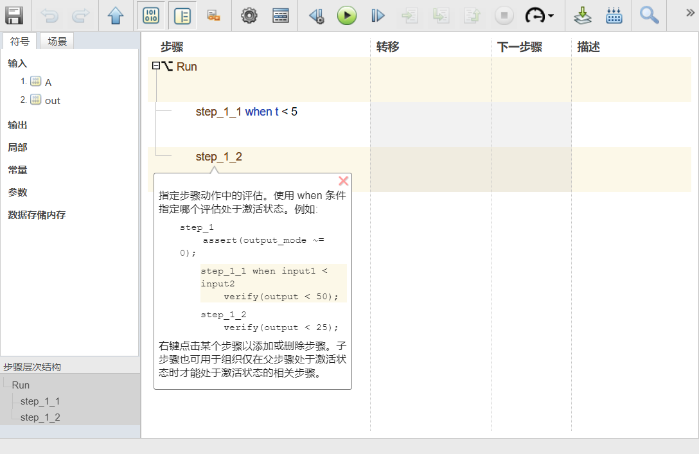
