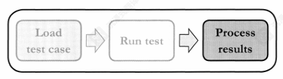
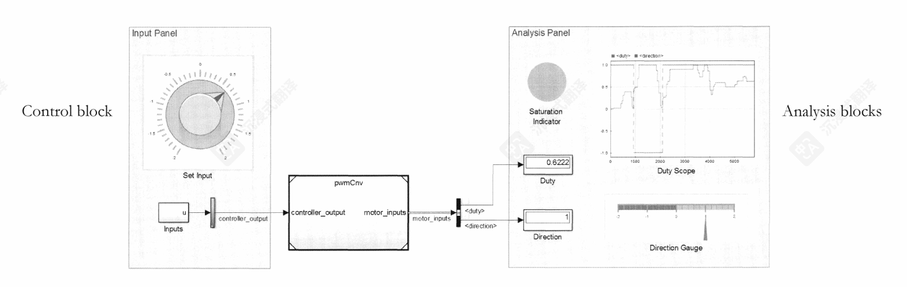
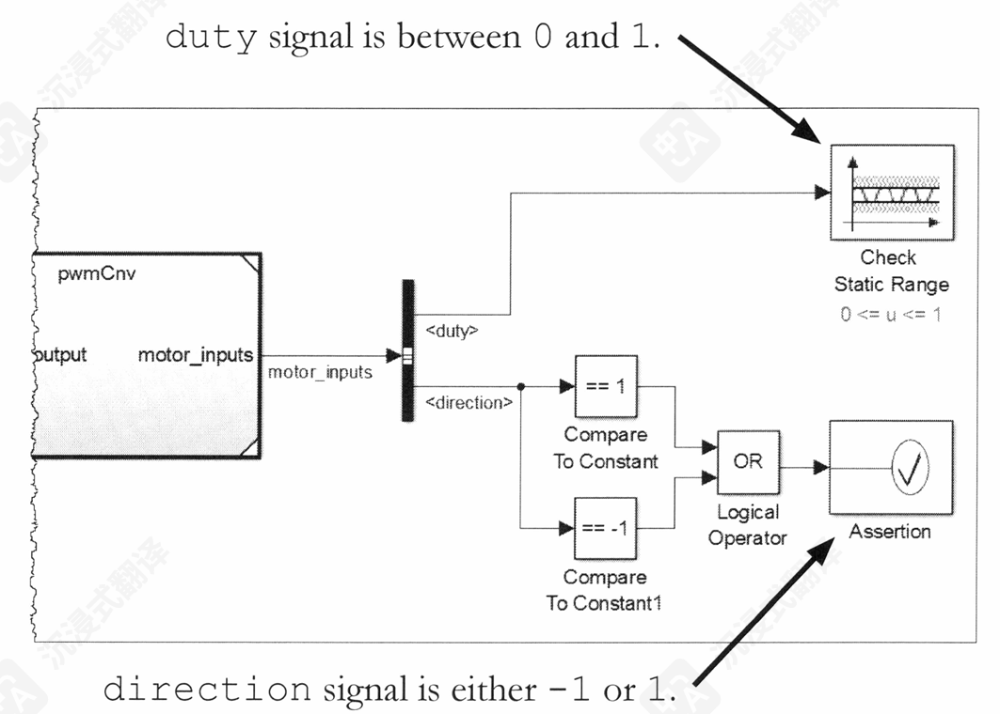
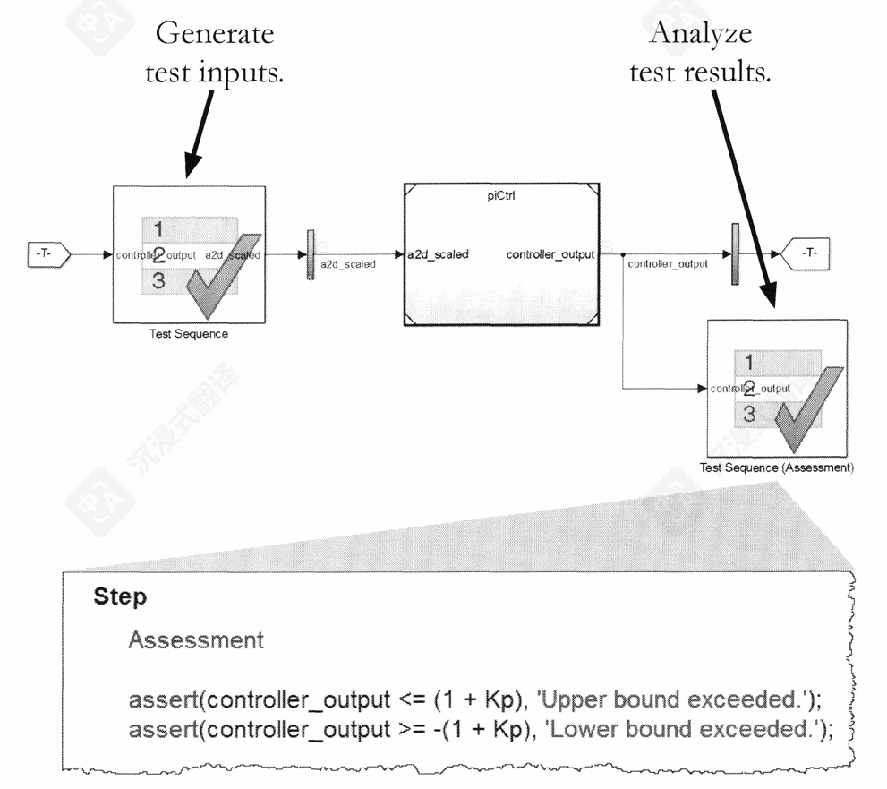
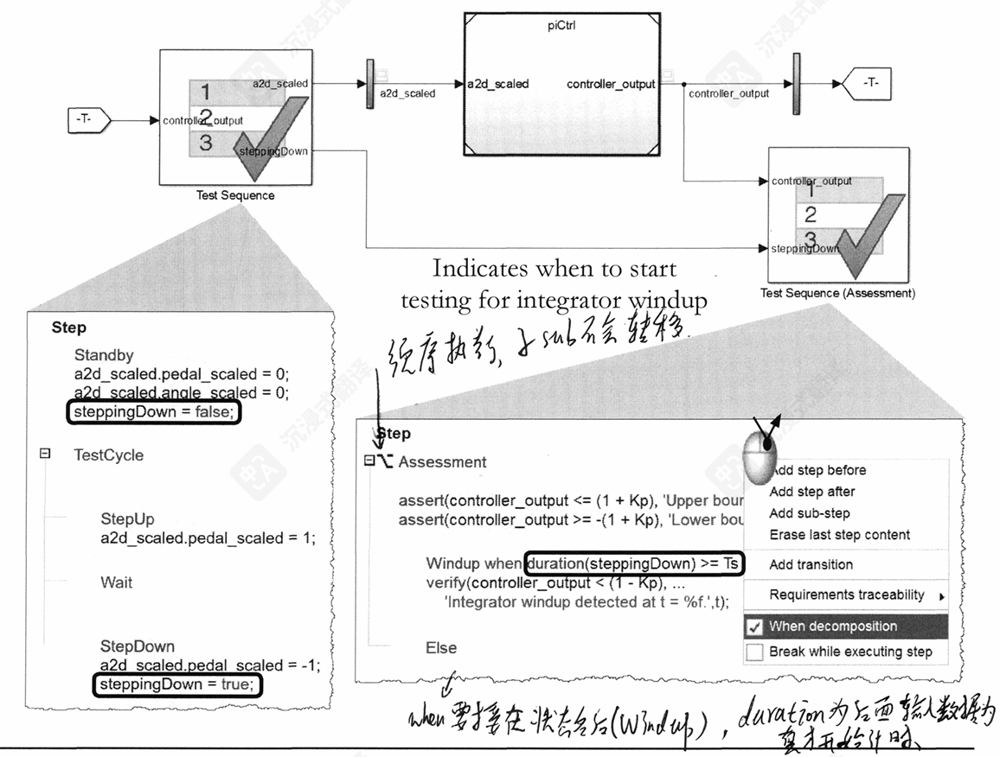

# 模型的验证和确认

## 目录

1.简介
2.基于模型的设计的验证与确认
3.开发测试用例
4.分析测试结果
5.构建测试套件
6.正式验证模型
7.结论
附录

## 1.简介

## 2.基于模型的设计的验证与确认

## 3.开发测试用例

## 4.分析测试结果

### 大纲

    *执行基于需求的评估
    *记录、检查和比较测试结果
    *收集模型覆盖率

### 要求

    *说明各种信号记录格式和选项。
    *使用Simulink模块对测试结果进行数学分析，以符合要求。
    *交互式可视化、检查和比较测试结果。
    *收集并显示测试用例的模型覆盖率。

#### （1）结果分析

*分析仿真测试结果通常涉及检查仿真输出，目标是更好地理解系统行为。*

    结果分析可以手动进行，也可以自动进行。

    手动测试结果的可视化，以及数据的交互式分析。
    通常，分析可能是探索性的，没有预先指定的目标。

    自动化—使用MATLAB代码或Simulink模块来分析数据，无需人工参与。
    通常分析会有预定义的目标，并且可能存在严格的通过/失败标准。

#### （2）分析方法

*关于Simulink模型数据，有两种常见的分析模式。*

**运行时分析：**

        使用simulink模块在仿真期间分析数据。这通常通过使用测试台来完成，这样你就不必在实际系统模型中添加分析模块。
        运行时分析通常在您希望检查模拟的每个时间步长的某些条件，或在其他情况下更自然地用Simulink模块建模时最为有用。

**仿真后分析：**

        收集模拟数据，然后在模拟完成后分析这些数据。这使得你可以将整套结果作为一个整体进行分析，而且可以在任何你方便的时候进行这项分析。

#### (3)执行探索性测试

*执行运行时分析的一种方法是通过模拟模型并手动探索模型是否按预期行为。*

        执行探索性分析的一种常见方法是在Simulink->Dashboard库中使用模块。这些模块可用于在Simulink模型中创建人机界面(HMI)。
    
Dashboard库模块可分为两大主要类别：

        Control（控制） — 用于修改模型中的可调参数和变量。这包括旋钮、滑块、按钮和开关。
        Visualization（可视化） — 用于在模型中可视化信号值。这包括灯、仪表和示波。

#### （4）使用模型验证模块的运行时分析

*另一种运行时分析方法是通过在测试harness的输出端添加模块来在仿真过程中对模型输出进行数学分析。这样，分析模块就不再是源模型的一部分，从而实现了设计和验证的分离。*

    包含此功能的一些simulink库：
        Signal Routing（信号路由） - 包含您可用于选择所需信号进行分析的模块。
        Logic and Bit Operations（逻辑和位操作） - 包含作为分析一部分有用的关系和逻辑运算符。
        Sinks（接收器） - 包含您可用于在仿真期间可视化仿真数据的显示模块。
        Model Verification（模型验证） - 包含检查信号范围、变化率或分辨率的模块。这些模块能够在信号违反给定条件时停止仿真并执行MATLAB命令（例如，输出错误消息）。

        该库还包含 Assertion block(断言模块)，可以根据逻辑输入信号停止仿真。这允许创建自己的运行时评估逻辑并将其与断言模块结合使用。
        断言的主要目的是在仿真运行期间，当输入信号的逻辑条件（布尔值）为假 (false) 时，立即触发一个错误或警告，并可以停止仿真。
    
*如果您的测试框架包含信号生成器模块，您可以为单个信号组启用和禁用 Verification block settings（模型验证模块）中的断言。为此，请显示模块的验证设置并使用验证模块设置部分。*

注意：您只能从信号构建器块中 Enable assertion（启用断言），如果该块中禁用了启用断言选项。

#### （5）Run-Time Analysis with Test Sequence Blocks（使用测试序列块进行运行时分析）

*上一章中，测试序列模块可以用于生成基于逻辑的测试输入无论是在开环还是闭环配置下。这个块也可以用于分析测试的输出。*

    例如：假设我们希望使用逻辑来停止模拟，如果以下任何条件被违反。

    *积分状态的值必须小于1。
    *积分状态的值必须大于-1。
    *在输入信号变为-1之后，积分器状态必须在不超过一个时间步长内去饱和。

    由于控制器还有一个比例分支，其增益为Kp，因此测试条件必须考虑到这一偏移由于测试输入使用控制器输入值为1或-1，因此测试条件可以按照以下方式来进行。

    控制器输出必须小于(1+Kp)。
    控制器输出必须大于-(1+Kp)。
    控制器输出必须在pedal_scaled信号从1降至-1后的一个时间步(TS)内小于(1-Kp)。

    注意 还有一个第四种条件，当pedal_scaled信号从-1步进到1时测试锁定。

方法：

    前两个条件可以使用assert函数进行测试。如果条件为假，模拟将停止并生成错误消息。您可以在函数的第二个参数中自定义错误消息。

    assert(controller_output <= (1 + Kp), 'Upper bound exceeded.");
    assert(controller_output >= -(1 + Kp), 'Lower bound exceeded.');

#### （6）Conditionally Analyzing Results（条件分析结果）

    第三个测试条件更难检查，因为它
        *需要系统当前状态的信息—当控制器输入从1降至0时是什么时候？
        *需要在一定时间后进行检查—在这种情况下，控制器输入降至0后的一个时间步。
        

## 5.构建测试套件

## 6.正式验证模型

## 7.结论

## 附录

