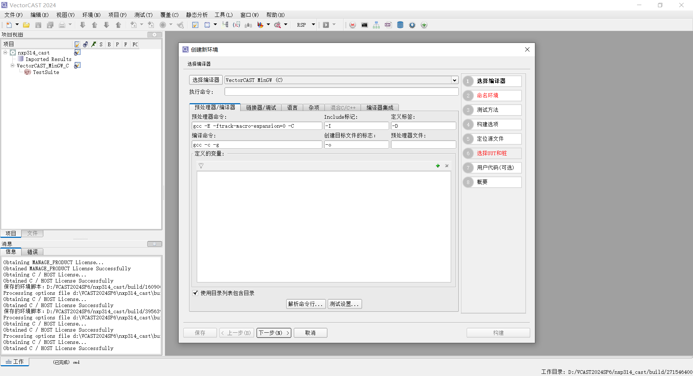
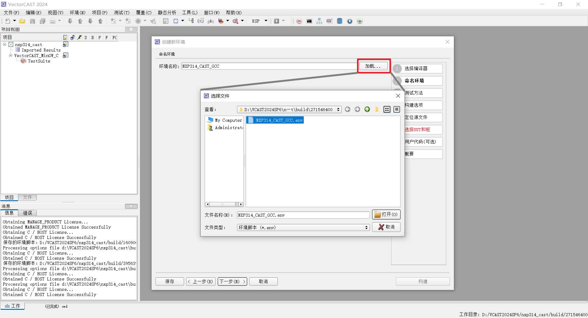

## 笔记

### CAST 创建单元测试环境（交互）

#### 创建交互单元测试环境

  

#### 步骤1：选择编译器

因为在创建项目时，设置了编译器，向导会跳过步骤1并直接打开步骤2：命名环境。

    目前暂时没有确定NXP的编译器配置，因此暂时默认使用GCC编译器。

#### 步骤2：命名环境

两种方式：

- 环境命名，该名称将成为一个目录

        环境名称：请输入您希望为新环境指定的唯一名称。您输入的任何空格字符都会转换为“_”字符。会创建一个以该名称命名的目录，并创建一个以该名称和“.vce”扩展名命名的文件。如果在工作目录中已存在具有该名称的目录，则该名称输入项将以红色显示出来。工具提示会要求您为该环境选择一个唯一的名称。

- 加载现有的环境脚本(.env)，导入整个向导的设置

        加载按钮：将现有的环境脚本加载到创建新环境对话框中，以创建与现有环境类似的环境。点击加载按钮，选择一个环境脚本(.env)，然后点击打开按钮。向导页面将根据环境脚本中的规范进行填充。此时您可以进行任何更改，然后构建环境。

#### 步骤3：测试方法

   不同测试方法适用于不同场景，影响源代码处理、桩 stub 生成和构建方式。主要有以下类型：

   | 测试方法 | 适用场景 | 区别 | 用法示例 |
   |----------|----------|------|----------|
   | **标准单元测试（Standard Unit Testing）** | 有完整源代码的函数/类测试 | - 需要源代码。 - 自动插桩（instrument）UUT。 - 生成完整 stub。 | 1. 选择 **Unit Testing**。 2. Step 6 选 UUT（如 `foo.c` 中的 `foo_func`）。 3. 构建后编辑测试用例（页 235）。**最常用**。 |
   | **对象文件测试（Object File Testing）** | 已编译 `.o`/`.obj` 文件，无需源代码 | - **无需源代码**，直接链接对象文件。 - 无覆盖率（coverage）。 - 快速验证二进制。 | 页 137：Step 4 指定对象路径。适合集成测试或第三方库。 |
   | **库接口测试（Library Interface Testing）** | 测试静态/动态库（`.a`/`.lib`/`.so`/`.dll`）API | - **无需库源代码**。 - 模拟库调用。 - 支持头文件接口。 | 页 140：指定库文件和头文件。用于验证库行为，无需重建库。 |
   | **测试驱动开发（Test Driven Development, TDD）** | 先写测试，再生成代码 | - **逆向**：从测试生成 UUT 骨架。 - 自动创建空函数实现。 - 迭代开发。 | 页 142：选择 TDD 模式，输入测试签名，生成 `UUT_stub.cpp`。**敏捷开发首选**。 |

   **选择建议**：

   | 场景 | 推荐方法 |
   |------|----------|
   | 新项目源代码测试 | 标准单元测试 |
   | 无源代码，只有二进制 | 对象文件 / 库接口 |
   | 敏捷/TDD 流程 | 测试驱动开发 |

#### 步骤4：构建选项

- 覆盖率类型：从下拉菜单中选择环境所需的代码覆盖率类型（可选）。若要构建一个无代码覆盖率的环境，请将覆盖率类型设置为“无”。  

        要在已打开的环境中关闭覆盖率，请使用环境=>更新环境命令。
        要在打开创建新环境向导时将覆盖率类型设置为默认设置，请使用工具=>选项对话框、向导选项卡、覆盖率类型选项。
        在环境构建完成后，您可以随时初始化代码覆盖率。

- 白盒：如果希望执行白盒转换，请勾选标有“白盒”的复选框。未勾选状态为默认值，除非已在工具=> 选项对话框的向导选项卡中勾选了“白盒”。  

        白盒使您能够测试测试单元中定义的静态函数和对象。对于C++，它还使您能够查看类中私有或受保护部分定义的成员函数和变量。

        白盒对源文件进行以下更改：
        - 从测试单元中定义的子程序和全局对象中删除'static'限定符。
        - 将类定义中UUT(s)的'private'和'protected'关键字替换'public'关键字，以便这些区域中定义的函数和对象对测试框架可见。

- VectorCAST为用户提供使用avcshell数据库构建环境的选项。当选定此选项时，向导将使用数据库中的信息来确定文件位置、目录位置和单元特定选项。

        - vcShell数据库文件：指定vcshell数据库的路径。向导将使用vcshell数据库（vcshell.db）中的信息来确定搜索目录、库包含目录和类型处理目录，以及任何单元特定选项和文件位置。
        - vcShell命令动词：Makefile中找到的命令动词列表显示在命令动词面板中。选择用于您打算在该环境中测试的源文件的命令动词。

#### 步骤5：定位源文件
